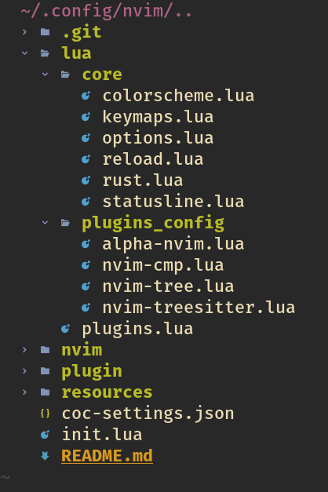
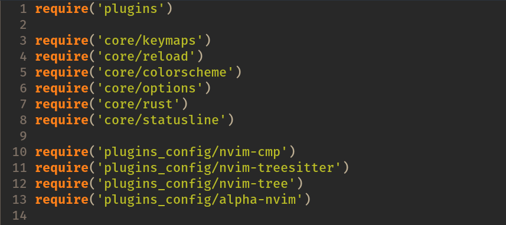

# Nvim Config Files

This repo is a workspace to store, and update my personal nvim configuration. 


**Important to notice, I have recently change my configuration system from using init.vim to the lua system.**

The *init.vim* configuration I have used came from *https://github.com/jonhoo*. I have modified this file along the way to comply with my preferences. The same thing was done with the **lua** system, I have used other people's configuration and just modified it so it can fit my preferences along with just translating the *init.vim* I already had, to the **lua** syntax. 


## Terminal and Shell Configuration
I personally use **Fish** as my default shell and **Alacritty** as my terminal. The configuration for both will be updated soon. 

## Text Editor or IDE
Arch Linux
```
sudo pacman -S neovim
```

Make sure to to have **neovim** at version 0.5.0 or higher

```
NVIM v0.7.0
Build type: Release
LuaJIT 2.1.0-beta3
Compiled by builduser

Features: +acl +iconv +tui
See ":help feature-compile"

   system vimrc file: "$VIM/sysinit.vim"
  fall-back for $VIM: "/usr/share/nvim"

Run :checkhealth for more info
```
This is the output of when I type 
```
nvim --version
```

Make sure the directory *~/.config/nvim* exist. If not make sure to make it.
```
mkdir ~/.config/nvim
```
Inside this directory is where we put the config file such as **init.vim** or **init.lua**. Neovim automatically looks at this directory for configuration file, and there must be an **init.vim** or **init.lua** in order for neovim to load those configurations.

Along with **nvim** as the IDE of choice there are also other programs/packages that must be installed along with *nvim* to allow the use of packages be much easier.

``` sudo pacman -S xclip python3 nodejs ```


## Nvim with Lua

I migrated my **init.vim** file to a better and more organized **lua** config system.

As regular **lua** system my configuration has the main *init.lua* file which calls the other **.lua** extensions to load configurations. The configuration directory is organize by 2 folders and a *plugins.lua* file.


 
As shown in the image above thanks to the package *nvim-tree* it can be seen we have a **core** folder which holds files that deal with the design and the usage of nvim. The **plugins_config** fodlder holds mostly plugins configurations. For example in order to setup the navigation of tabs and files by the use of **Nvim-Tree** some more configurations had to be loaded https://github.com/kyazdani42/nvim-tree.lua. 

I won't go into much detail on what is on the **plugins_config or the core** folder because most of the syntax and code written was by just following examples given in their github and it will be time consuming. Most of the files have comments to explain each line.

### init.lua


Nothing out of the ordinary with the **init.lua** file other than just calling the other extensions.


### Packer Install
Make sure to get into nvim once the this configuration is installed and start installing the packages required. 

The package installer used is *Packer*. All the user needs to do once in nvim is to type the following command.

```:PackerInstall```

Which will install all the required packages such as **Coc**. Coc is the package used in order to install extensions and tools to help code specific type of files. In my case in a Rust fanatic, so I used Coc to install *rust-analyzer* then configured the *coc-settings.json* to configure the way to handle errors and warning messages. This means that *coc-settings.json* is not required to have when using this config. Just keep in mind that there are files that use some of Coc commands which may later cause errors. 


## Icons

It's important to have some type of *Font-Family* installed in order to see the icons used in this config. The one I personally use in my terminal is **Fira Mono** https://github.com/mozilla/Fira. 

## Helpful Links